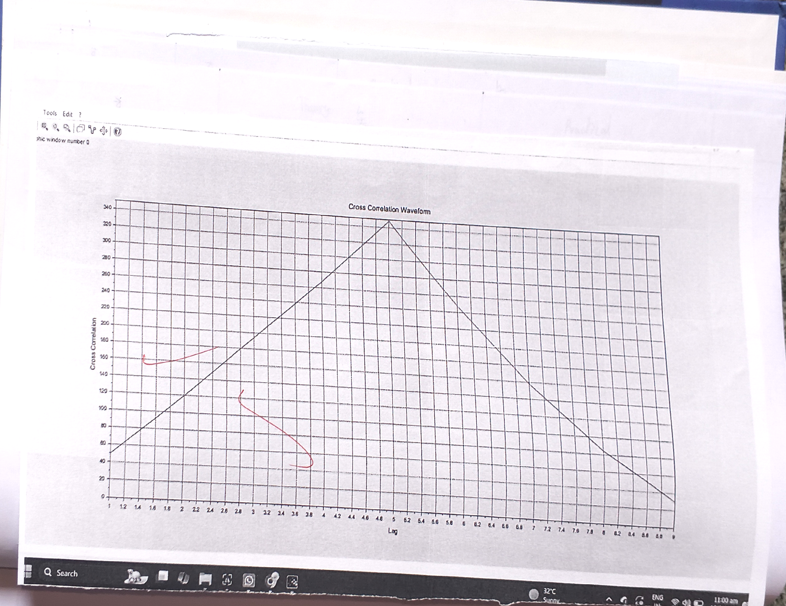
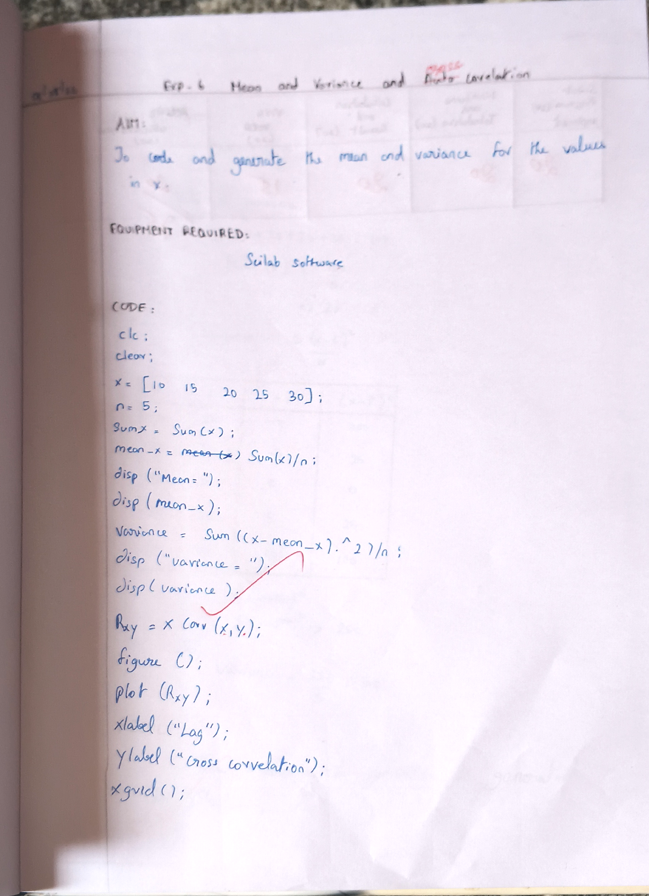

# SIMULATION-OF-AUTOCORRELATION-AND-PSD-USING-SCILAB---T1---M4---ODD
# SIMULATION OF AUTOCORRELATION AND PSD USING SCILAB

## AIM

Write a program for Autocorrelation and PSD of signals in SCILAB and verify Wiener-Khinchin relation.

## EQUIPMENTS NEEDED

- Computer with i3 Processor
- SCI LAB

## THEORY

The Wiener-Khinchin theorem states that the power spectral density of a wide sense stationary random process is the Fourier transform of the corresponding autocorrelation function.

### Power Spectral Density (PSD)

$$
S_{XX}(\omega)=FT[R_{XX}(\tau)]
=\int_{-\infty}^{\infty}R_{XX}(\tau)e^{-j\omega\tau}d\tau
$$

### Autocorrelation Function (ACF)

$$
R_{XX}(\tau)=IFT[S_{XX}(\omega)]
=\frac{1}{2\pi}\int_{-\infty}^{\infty}S_{XX}(\omega)e^{j\omega\tau}d\omega
$$

## ALGORITHM

### 1. Load or Define the Signal:

Input your time-domain signal.

### 2. Compute Autocorrelation:

Calculate the autocorrelation function of the signal.

### 3. Compute Power Spectral Density (PSD):

Estimate the PSD of the signal, either directly using a method like Welch’s periodogram or by using the Fourier transform of the autocorrelation.

### 4. Plot Results:

Visualize the autocorrelation function and PSD.

## PROCEDURE

- Refer Algorithms and write code for the experiment.
- Open SCILAB in System.
- Type your code in New Editor.
- Save the file.
- Execute the code.
- If any Error, correct it in code and execute again.
- Verify the generated waveform using Tabulation and Model Waveform.

## MODEL GRAPH / SCILAB OUTPUT



## AIM / CODE



### Scilab Source Code

```scilab
clc;
clear;
x = [10 15 20 25 30];
n = 5;
sum_x = sum(x);
mean_x = sum(x)/n;
disp("Mean = ");
disp(mean_x);
variance = sum((x - mean_x).^2)/n;
disp("Variance = ");
disp(variance);
Rxy = xcorr(x, x);
figure();
plot(Rxy);
xlabel("Lag");
ylabel("Cross correlation");
xgrid();
```

## TABULATION

| $x$ | $\bar{x}$ | $x - \bar{x}$ | $(x - \bar{x})^2$ |
| --- | --------- | ------------- | ----------------- |
| 10  | 20        | -10           | 100               |
| 15  | 20        | -5            | 25                |
| 20  | 20        | 0             | 0                 |
| 25  | 20        | 5             | 25                |
| 30  | 20        | 10            | 100               |


## CALCULATIONS

$$
\text{Mean } (\bar{x}) = \frac{\sum x}{n} = \frac{10 + 15 + 20 + 25 + 30}{5} = \frac{100}{5} = 20
$$

$$
\text{Variance} = \frac{\sum (x - \bar{x})^2}{N} = \frac{250}{5} = 50
$$


## RESULT

The mean, variance, and autocorrelation are simulated and verified using SCILAB.

- **Mean**: 20
- **Variance**: 50


## RECORD EVALUATION


